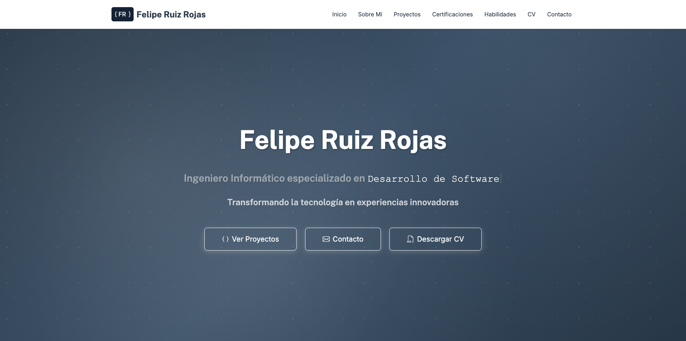

====================================================================================
# FRONT-END — PORTAFOLIO DE FELIPE RUIZ ROJAS

NOTAS:
- Implementación con JavaScript, CSS y Bootstrap

====================================================================================

# 🙎🏻‍♂️ Portafolio — Felipe Ruiz Rojas (Frontend)

> Sitio web estático que muestra proyectos, certificaciones y datos de contacto de Felipe Ruiz Rojas. Es el frontend del portafolio personal y está pensado para presentaciones profesionales y demostraciones de frontend.

## 📝 Descripción general
Este repositorio contiene el código del frontend del portafolio personal de Felipe Ruiz Rojas. Está implementado con HTML, CSS (incluyendo archivos de estilo personalizados) y JavaScript, y usa Bootstrap para componentes y responsive layout.

El sitio permite:
- Mostrar proyectos con enlaces y descripciones.
- Listar certificaciones y experiencia relevante.
- Descargar o visualizar el CV.
- Contactar al autor mediante formulario o enlaces externos.

## 🎯 Objetivos del proyecto
- Crear una presentación web limpia y accesible para mostrar el trabajo profesional.
- Practicar y demostrar habilidades en HTML, CSS, JavaScript y diseño responsivo.
- Proveer un repositorio fácil de desplegar (GitHub Pages u otra plataforma estática).

## 🧱 Tecnologías y herramientas
- HTML5
- CSS3 (archivos en `styles/`)
- JavaScript (archivos en `js/` y `modules/`)
- Bootstrap (v4/v5 según referencia en el proyecto)
- Recursos estáticos en `assets/` (imágenes, documentos)

[](https://skillicons.dev)

## 📂 Estructura del proyecto
Estructura principal (resumen):

```text
/
├── assets/            # imágenes, logos y documentos
│   ├── docs/
│   └── img/
│       ├── favicon/
│       └── logo/
├── data/              # JSON con proyectos y certificaciones
│   ├── certifications.json
│   └── proyects.json
├── js/                # lógica principal y componentes
│   ├── main.js
│   └── components/
│       └── home.js
├── modules/           # módulos reutilizables (navegación, footer)
│   ├── footer.js
│   └── navigation.js
├── styles/            # hojas de estilo
│   ├── main.css
│   ├── custom_styles.css
│   └── ...
└── index.html         # entrada principal
```

## Mapa del sitio
- Inicio (`index.html`)
- Proyectos (sección que consume `data/proyects.json`)
- Certificaciones (sección que consume `data/certifications.json`)
- CV / Descargas
- Contacto

## Paleta de colores
Sección de referencia. Añade aquí los colores oficiales del portfolio si quieres mantener consistencia de marca.

| Color             | Hex       | Uso principal |
|-------------------|-----------|---------------|
| Primario (ej.)    | #0d6efd   | Botones/links |
| Secundario (ej.)  | #6c757d   | Fondo de tarjetas |

> Nota: reemplaza los valores por la paleta real del proyecto si la tienes.

## 🧠 Validaciones y reglas de negocio
- Validaciones básicas en cliente: campos de formulario (email, mensaje) y manejo de errores simples.
- Contenido dinámico cargado desde JSON en `data/`.
- El proyecto es estático; si añades un backend, documenta los endpoints y contratos.

## 👨‍💻 Autor
- Felipe Ruiz Rojas

Contacto:
- Correo: felruiz.a@gmail.com
- LinkedIn: https://www.linkedin.com/in/felandres/

## 📸 Vista previa


## REPOSITORIO
- URL del repositorio: https://github.com/ruizRojasFel/portafolio_fel_ruiz.git

## GITHUB PAGES
- Sitio en GitHub Pages (si aplica): https://ruizrojasfel.github.io/portafolio_fel_ruiz/

## 📜 Licencia
Este proyecto fue desarrollado con fines personales.

************************************************************************************